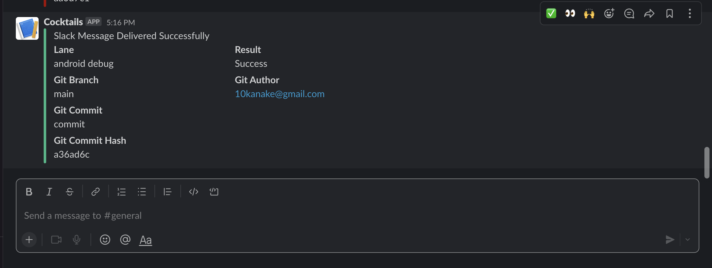
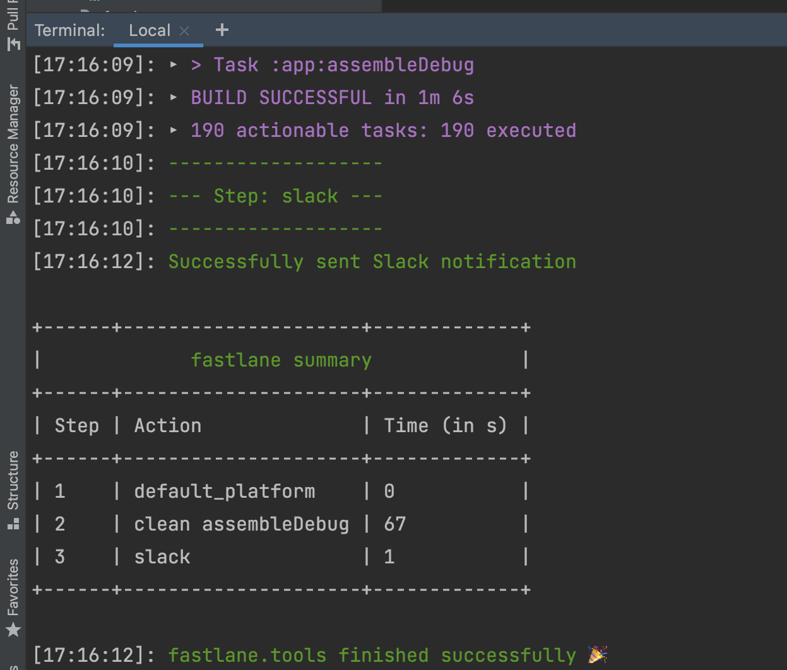

# Cocktail_CleanArchitecture
 Mobile App to show various cocktails🍸  🍷 🍹 from the CockTailDB API.Written using Kotlin, Clean Architecture ,MVVM, Room ,DI and other jetpack libraries.
 
 Min Api:21
 
 ## Table of Contents

- [Prerequisite](#prerequisites)
- [Dependencies](#dependencies)
- [Danger](#danger)
- [Architecture](#architecture)
- [Techstack](#techstack)
- [Libraries](#libraries)
- [Screenshots](#screenshots)
- [SlackMessage](#slackmessage)
 
 ### Prerequisites
 Change the prefix of the BASE_URL from `www` to `https` in order to successfully load data.
 
 To check for dependency updates, run the following gradlew command:

```shell script
./gradlew dependencyUpdate
```
Good thing the plugin does not update dependencies whose versions are not stable yet 🥳 🥳 .

## Dependencies

All the dependencies (external libraries) are defined in the single place - Gradle `scripts/versions.gradle` folder. This approach allows to easily manage dependencies and use the same dependency version across all modules.
Each of the tools has its own Gradle file in the [scripts folder](/scripts). This is by design so that if you chose to have a multi module project, these dependencies can easily be shared between them. This is already configured inside our root `build.gradle` file, by applying to each sub project:

## Danger

This template uses [Danger](https://danger.systems) which will perform some checks against our 
pull requests. You can find the list of checks in the [Dangerfile](Dangerfile). In addition, we 
have a GitHub Actions workflow for Danger checks. In order for that to work, you'll need a 
Danger API key setup in your GitHub secrets. Info on this can be found [here](https://www.jessesquires.com/blog/2020/04/10/running-danger-on-github-actions/). 

## Architecture

The app is built using the Modular MVVM architectural pattern and makes heavy use of a couple of
Android Jetpack components. MVVM allows for the separation of concern which also makes testing
easier. The app has a fragment that communicates to ViewModel which in turn communicates to the
usecase which communiacates to Repository to get data.

||
|:----:|

## Techstack

* Tech-stack
    * [Kotlin](https://kotlinlang.org/) - a cross-platform, statically typed, general-purpose programming language with type inference.
    * [Coroutines](https://kotlinlang.org/docs/reference/coroutines-overview.html) - perform background operations.
    * [Flow](https://kotlinlang.org/docs/reference/coroutines/flow.html) - handle the stream of data asynchronously that executes sequentially.
    * [KOIN](https://insert-koin.io/) - a pragmatic lightweight dependency injection framework.
    * [View Binding](https://developer.android.com/topic/libraries/view-binding/) - A feature that allows you to more easily write code that interacts with views.
    * [Android KTX](https://developer.android.com/kotlin/ktx.html) - Provide concise, idiomatic Kotlin to Jetpack and Android platform APIs.
    * [AndroidX](https://developer.android.com/jetpack/androidx) - Major improvement to the original Android [Support Library](https://developer.android.com/topic/libraries/support-library/index), which is no longer maintained.
  
    * [Jetpack](https://developer.android.com/jetpack)🚀
        * [Room](https://developer.android.com/topic/libraries/architecture/room) - a persistence library provides an abstraction layer over SQLite.
        * [LiveData](https://developer.android.com/topic/libraries/architecture/livedata) - is an observable data holder.
        * [Lifecycle](https://developer.android.com/topic/libraries/architecture/lifecycle) - perform action when lifecycle state changes.
        * [ViewModel](https://developer.android.com/topic/libraries/architecture/viewmodel) - store and manage UI-related data in a lifecycle conscious way.
        * [Git Hooks](/documentation/GitHooks.md) for automatically perform static analysis checks. 
        * [Gradle Versions Plugin](/documentation/VersionsPlugin.md) for checking all dependencies for new versions.
        * [Danger](/documentation/VersionsPlugin.md) which will perform some checks against our pull requests.


* Architecture
    * MVVM - Model View View Model
* Gradle
    * Plugins
        * [Ktlint](https://github.com/JLLeitschuh/ktlint-gradle) - creates convenient tasks in your Gradle project that run ktlint checks or do code auto format.
        * [Detekt](https://github.com/detekt/detekt) - a static code analysis tool for the Kotlin programming language.
        * [Spotless](https://github.com/diffplug/spotless) - format java, groovy, markdown and license headers using gradle.
        * [Dokka](https://github.com/Kotlin/dokka) - a documentation engine for Kotlin, performing the same function as javadoc for Java.
        * [Danger](https://danger.systems/) - a documentation engine for Kotlin, performing the same function as javadoc for Java.
        
* CI/CD
    * Github Actions

## Screenshots
The final app looks like this:
Collapsing ToolBar | CockTails | Shimmer
--- | --- | ---
 |  | 

## SlackMessage
Using fastlane to send a message to Slack once our app compiles successfully.

`fastlane android debug`

|| ||


